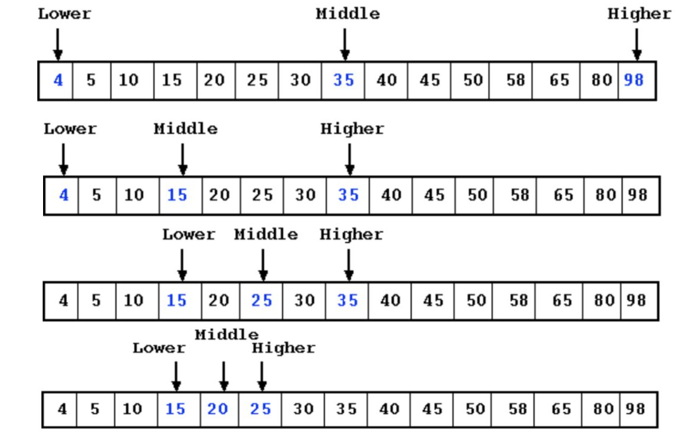

## Binary Search

*A natural elimination-based strategy for searching a sorted array.

*Main idea: eliminate half (lower or upper) of the keys from consideration, while keeping the keys in sorted order.
*As an example, given a sorted array of integers, [4,5,10,15,20,25,30,35,40,45,50,58,65,80,98], find the target, 20 andreturn its position.
*Algorithm:



```javascript
function binarySearch(searchArray, searchElement) {
  let minIndex = 0;
  let maxIndex = searchArray.length;
  let currentIndex;
  let currentElement;
  while (minIndex <= maxIndex) {
    currentIndex = Math.floor((maxIndex + minIndex) / 2);
    currentElement = searchArray[currentIndex];
    if (searchElement < currentElement) {
      maxIndex = currentIndex - 1;
    } else if (searchElement > currentElement) {
      minIndex = currentIndex + 1;
    } else {
      return currentIndex;
    }
  }
  return -1;
}

console.log(binarySearch([1,2,3,4,5,6,7,8], 8));
```