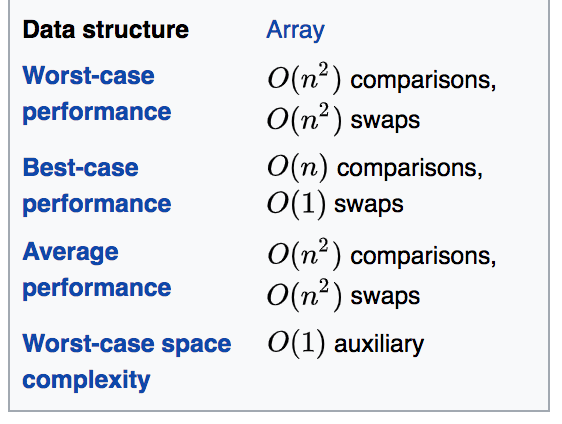
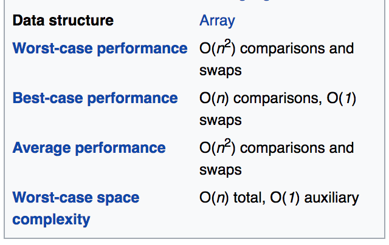
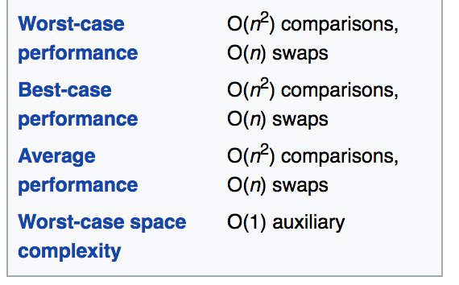
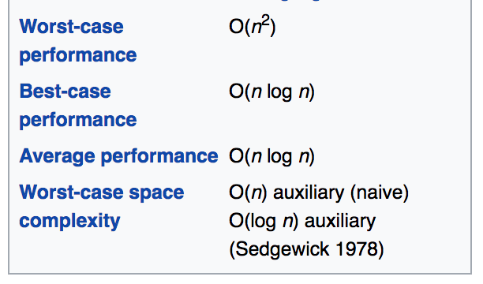

## Merge Sort

```javascript
const unsortedArr = [340, 1, 3, 3, 76, 23, 4, 12, 122, 7642, 646];

function merge(leftArr, rightArr) {
    const sortedArr = [];
    while (leftArr.length && rightArr.length) {
        if (leftArr[0] <= rightArr[0]) {
            sortedArr.push(leftArr[0]);
            leftArr = leftArr.slice(1)
        } else {
            sortedArr.push(rightArr[0]);
            rightArr = rightArr.slice(1)
        }
    }
    while (leftArr.length)
        sortedArr.push(leftArr.shift());
    while (rightArr.length)
        sortedArr.push(rightArr.shift());
    return sortedArr;
}

function mergesort(arr) {
  if (arr.length < 2) {
    return arr;
  }
  else {
    const midpoint = parseInt(arr.length / 2);
    const leftArr   = arr.slice(0, midpoint);
    const rightArr  = arr.slice(midpoint, arr.length);
    return merge(mergesort(leftArr), mergesort(rightArr));
  }
}

console.log('This should be the sorted array!');
console.log(mergesort(unsortedArr));
```


## Bubble Sort


```javascript
function bubbleSort(items) {
  const length = items.length;
  for (let i = 0; i < length; i++) { //Number of passes
    for (let j = 0; j < length - i; j++) { //Notice that j < (length - i)
      //Compare the adjacent positions
      if (items[j] > items[j + 1]) {
        //Swap the numbers
        const tmp = items[j]; //Temporary variable to hold the current number
        items[j] = items[j + 1]; //Replace current number with adjacent number
        items[j + 1] = tmp; //Replace adjacent number with current number
      }
    }
  }
}

```



## Insertion Sort


```javascript
function insertionSort(unsortedList) {
	const len = unsortedList.length;
	for (let i = 1; i < len; i++) {
		const tmp = unsortedList[i]; //Copy of the current element. 
		/*Check through the sorted part and compare with the number in tmp. If large, shift the number*/
		for (let j = i - 1; j >= 0 && (unsortedList[j] > tmp); j--) {
			//Shift the number
			unsortedList[j + 1] = unsortedList[j];
		}
		//Insert the copied number at the correct position
		//in sorted part. 
		unsortedList[j + 1] = tmp;
	}
}

const ul = [5, 3, 1, 2, 4];
insertionSort(ul);
console.log(ul);
```



## Selection Sort


```javascript
function selectionSort(items) {
	const length = items.length;
	for (let i = 0; i < length - 1; i++) {
		//Number of passes
		const min = i; //min holds the current minimum number position for each pass; i holds the Initial min number
		for (let j = i + 1; j < length; j++) { //Note that j = i + 1 as we only need to go through unsorted array
			if (items[j] < items[min]) { //Compare the numbers
				min = j; //Change the current min number position if a smaller num is found
			}
		}
		if (min != i) {
			//After each pass, if the current min num != initial min num, exchange the position.
			//Swap the numbers 
			const tmp = items[i];
			items[i] = items[min];
			items[min] = tmp;
		}
	}
}
```


## Quick Sort
### (sometimes called partition-exchange sort)


```javascript

function swap(items, firstIndex, secondIndex){
    let temp = items[firstIndex];
    items[firstIndex] = items[secondIndex];
    items[secondIndex] = temp;
}

function partition(items, left, right) {
    let pivot = items[Math.floor((right + left) / 2)];
    let i = left;
    let j = right;
    while (i <= j) {
        while (items[i] < pivot) {
            i++;
        }
        while (items[j] > pivot) {
            j--;
        }
        if (i <= j) {
            swap(items, i, j);
            i++;
            j--;
        }
    }
    return i;
}

function quickSort(items, left, right) {
    let index;
    if (items.length > 1) {
        index = partition(items, left, right);
        if (left < index - 1) {
            quickSort(items, left, index - 1);
        }
        if (index < right) {
            quickSort(items, index, right);
        }
    }
    return items;
}


// first call
console.log(quickSort(items, 0, items.length - 1));

### Second method

const arr = [6, 1, 5, 3, 9, 6, 7, 10, 16, 4, 0, 12, 2]

function qsort(arr){
    if (arr.length < 2) return arr
    // choose a pivot, p
    // the choice of pivot can effect worst-case performance
    // for this, we'll just use the first element.
    const [p, ...rest] = arr

    // partition array into element greater and lesser that the pivot
    // this can be optimized so you don't loop through the array twice
    const low  = rest.filter(n => n <= p)
    const high = rest.filter(n => n > p)

    // recurse on both partitions and reassemble as recursion unwinds
    return [...qsort(low), p, ...qsort(high)]
}
console.log(qsort(arr).join(', '))


```

